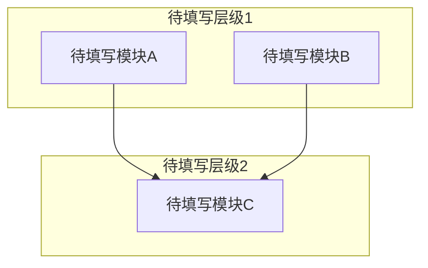

# 系统架构

<!-- 概述引导 -->
<!--
  写 2-4 句概述段落，描述系统的整体架构。
  每个结论都附带代码证据，使用符号锚点格式：
    ClassName::methodName()  或  filename.cpp → functionName()
-->

## 模块划分

<!-- 模块划分引导 -->
<!--
  本引导用于逆向现有代码并生成架构文档。分为两个阶段：
  1. 模块发现（从代码中产出候选模块）
  2. 模块评估（对每个模块进行描述、内聚性校验与权重打分）

  ═══════════════════════════════════════════════════════════
  一、模块发现启发式（逆向工程第一步）
  ═══════════════════════════════════════════════════════════
  从代码仓库中提取候选模块时，按以下优先级执行：
  - 以一级源码目录作为初始候选模块。
  - 对于 utils、common、shared 等（包括但不限于这些例子）命名模糊的目录，尝试通过依赖分析将其拆解或归并到明确职责的模块中。
  - 识别横切关注点（如日志、鉴权、配置、监控、异常处理），将其作为独立模块抽取，不强行归属业务模块。
  - 若存在包/命名空间，可将公开 API 聚集的包视为一个候选模块。
  产出的每个候选模块都将进入下面的评估流程。

  ═══════════════════════════════════════════════════════════
  二、模块职责描述
  ═══════════════════════════════════════════════════════════
  为每个模块写出 2-3 句职责描述，说明该模块解决什么问题、对外提供什么能力。
  不要仅写模块名，避免“UserManager”这类空洞命名。

  ═══════════════════════════════════════════════════════════
  三、模块命名规则
  ═══════════════════════════════════════════════════════════
  模块名不得使用"与/和/及"连接不相关的概念。

  例外条件（三条件必须全部满足才允许使用连接词）：
  1. 共享接口定义 — 各子模块实现同一抽象接口（有明确的虚基类定义）
  2. 同库编译 — 编译为同一个二进制目标
  3. 编译期互锁 — 头文件层面不可分离（移除A导致B编译失败）

  不满足任一条件 → 必须拆分为独立模块。
  满足全部三个条件 → 可使用连接词，但需在职责描述中注明三条件满足的证据。
  ═══════════════════════════════════════════════════════════
  四、综合权重评估（指导 review / 重构优先级）
  ═══════════════════════════════════════════════════════════
  对每个模块从以下 7 个维度给出 1-5 分的综合权重。
  评分时请参照附带的锚点说明以保持一致性。
  综合权重 = 七维评分之和（范围 7~35 分）。

  维度：
    1. 功能重要度 — 该模块对核心业务的价值
    2. 结构复杂度 — 代码规模、类层次深度、设计模式使用等
    3. 接口广度 — 公开 API 数量、被依赖的模块数
    4. 数据 richness — 处理的数据结构复杂度、状态数量、模型转换
    5. 变更热度 — 近期修改频率、需求变动可能性
    6. 风险集中度 — 出问题时的影响范围和修复难度
    7. 外部可见性 — 该模块对最终用户/运维人员的直接可见程度
       - 5: 被最终用户直接操作（HMI/CLI/HTTP API）或被运维部署/配置/迁移时直接接触
            （数据库schema、配置文件格式、部署拓扑）
       - 4: 是独立可执行程序/服务，有独立的启动/停止/配置生命周期
       - 3: 被 >=3 个其他模块依赖，且提供运行时可见的行为（通信协议帧格式、加密算法选择）
       - 2: 被其他模块依赖，但行为仅在编译时或内部可见
       - 1: 纯内部实现细节，外部完全不可见

  关键：外部可见性不随代码复杂度变化。一个50行的CLI入口工具外部可见性可能是5；
  一个2000行的内部引擎外部可见性可能是1。

  评分锚点简易参考（帮助你给出更一致的分数）：

  | 分数 | 功能重要度             | 结构复杂度                 | 接口广度                   | 数据 richness            | 变更热度                       | 风险集中度                 | 外部可见性                 |
  |------|----------------------|--------------------------|----------------------------|--------------------------|--------------------------------|----------------------------|----------------------------|
  | 1    | 辅助/实验功能         | 少量函数，无类层次        | 0~2 个公开 API             | 基本类型，无状态          | 一年未变更                     | 出问题仅影响自身           | 纯内部实现，外部不可见     |
  | 3    | 支撑核心流程的一环     | 数个类，简单继承/组合     | 5~10 个 API，被 <5 个模块依赖 | 核心实体，多状态流转     | 月均1~2次提交，需求偶有变动    | 影响同层多个模块           | 独立进程，有独立启停生命周期 |
  | 5    | 核心价值/系统立足之本  | 深层继承，复杂设计模式    | 20+ API，被 10+ 模块依赖    | 复杂DSL、多模型转换      | 每周多次变更，需求频繁调整     | 会导致系统宕机或数据损坏   | 最终用户直接操作或运维直接接触 |

  变更热度数据来源：优先读取 Git 历史（最近 6 个月提交频率）。
  若无版本历史（例如初始代码转储），该维度默认评为 3 分，并在备注中标注"无历史数据，中性评分"。
  ═══════════════════════════════════════════════════════════
  五、复杂度概要格式
  ═══════════════════════════════════════════════════════════
  为每个模块提供一行“复杂度概要”，格式如下：
  “~行数/文件数，M 个公开 API，依赖 N 个模块”
  示例：“~500 行/8 文件，6 个公开 API，依赖 3 个模块”
-->

| 模块名 | 所属层级 | 核心职责 | 目录路径 | 依赖模块 | 复杂度概要 | 综合权重 |
|--------|----------|----------|----------|----------|------------|----------|
| 待填写 | 待填写 | 待填写 | 待填写 | 待填写 | 待填写 | 待填写 |

## 模块依赖关系图

<!-- 依赖关系图引导 -->
<!--
  必须包含模块划分表中的每一个模块。用 mermaid subgraph 按层级分组
  （表示层 / 业务逻辑层 / 数据访问层 / 基础设施层）。
  箭头方向表示依赖关系：A --> B 表示 A 依赖 B。
  如果存在循环依赖，如实画出——循环依赖条目写入 04-问题与改进.md > 架构违规。
  不允许使用省略号——每个模块都必须显式出现在图中。
  仅包含项目内部模块——不画出 Qt、SQLite 等外部库节点。外部依赖在"外部依赖"表格中描述。
-->

## 数据流

<!-- 数据流引导 -->
<!--
  描述项目的核心端到端数据流。数据流分为两个层级：

  L1（本文档 — 00-架构.md）：跨模块数据流
  - 以模块为粒度描述数据如何在模块间传递
  - 每个步骤 = "模块A → 模块B"，描述传递什么数据、什么形态变化
  - 不描述模块内部的函数调用链（那是L2的内容，见03-详细设计）

  L2（03-详细设计/<模块名>.md）：模块内部业务流程
  - 在对应模块的"核心业务流程"章节中展开
  - 描述模块内部的函数调用链、条件分支、循环逻辑

  L1/L2 边界规则：
  - 如果某个步骤描述的是"模块内部如何实现"（如"创建GTS设备模板实例"
    "取最后5个采样点平均值"）→ 属于L2，不应出现在此处
  - 如果某个步骤描述的是"模块A向模块B传递了什么" → 属于L1

  数据流数量：由项目的端到端业务场景自然决定。不设最少/最多限制。
  从以下角度逐一排查：
  - 系统启动流程
  - 每条写路径（用户操作 → 数据持久化）
  - 每条读路径（用户请求 → 数据展示）
  - 每条系统间交互路径（外部触发 → 系统响应）
  - 每条定时/后台任务路径
  仅描述确实存在的路径，不虚构。

  每个数据流步骤必须使用符号锚点格式：
    ClassName::methodName()  或  filename.cpp → functionName()

  每条数据流用 ### 标题 + 有序列表组织，不使用表格。
-->

### 数据流 1: 待填写

**触发**：待填写（什么事件/请求启动了这条流）

**链路**：
1. **模块A** `ModuleA::entryPoint()` — 做什么
2. **模块B** `ModuleB::processData()` — 做什么
3. **模块C** `ModuleC::persist()` — 做什么

**数据形态变化**：待填写 → 待填写 → 待填写

**持久化点**：待填写（数据库表/文件/缓存 key）

### 数据流 2: 待填写

**触发**：待填写

**链路**：
1. **模块A** `ModuleA::query()` — 做什么
2. **模块B** `ModuleB::format()` — 做什么

**数据形态变化**：待填写 → 待填写

**持久化点**：待填写

## 外部依赖

<!-- 外部依赖引导 -->
<!--
  列出项目运行时依赖的所有外部系统和中间件，不包括开发工具（构建/测试工具见 02-决策记录.md）。
  按关键程度排序，关键的放前面。
  "故障影响"列：描述该依赖不可用时系统会出现什么症状。
-->

| 依赖 | 用途 | 关键程度 | 故障影响 |
|------|------|----------|----------|
| 待填写 | 待填写 | 高/中/低 | 待填写 |

## 认知边界地图

<!-- 认知边界引导 -->
<!--
  建立知识资产负债表，区分三个层次：
  - 已知已知：通过阅读具体代码确认的事实
  - 已知未知：Agent 无法确定、需要人工补充的内容
  - 推断结论：从代码模式推断但未确认的设计决策

  已知已知验证标准：证据列必须使用符号锚点格式
    ClassName::methodName()  或  filename.cpp → functionName()
  已知未知应写具体问题（如"身份验证机制：未找到 token 生成/验证的代码位置"）。
  推断结论的可靠性：有符号锚点 = 代码证据充分；无锚点 = 基于有限证据，待确认。
-->

### 已知已知

| 编号 | 代码证据（符号锚点） | 确认内容 |
|------|----------------------|----------|
| 待分析 | 待分析 | 待分析 |

### 已知未知

| 编号 | 未知内容 | 影响 | 调查方向 |
|------|----------|------|----------|
| 待分析 | 待分析 | 待分析 | 待分析 |

### 推断结论

| 编号 | 推断内容 | 证据 |
|------|----------|------|
| 待分析 | 待分析 | 待分析 |

---

<!--
  Agent 机械自检（以下项 Agent 可自信验证）：
  - [ ] front matter 字段非空且值在允许集合内
  - [ ] 每个表格至少有一行非占位数据
  - [ ] 模块依赖关系图包含模块划分表中的所有模块
  - [ ] 外部依赖表涵盖所有运行时依赖（版本/协议细节 → 02）
  - [ ] 认知边界地图三个子表已填写
  - [ ] 无 "..." 占位符
  - [ ] 模块命名符合规则：无模块名包含"与/和/及"连接不相关概念
  - [ ] 数据流链路中每个步骤都使用了符号锚点格式
  - [ ] 认知边界地图证据列使用符号锚点格式

  深度自检（定性追问，Agent 生成完成后逐项回答）：
  - [ ] **数据流覆盖**：列出系统所有主要用户操作，是否每个主要操作都有独立的数据流追踪？如有操作缺少追踪，在文档中说明原因
  - [ ] **模块粒度**：是否存在一个"模块"包含了分属不同架构层级的类（如 View 和 Model 混在同一个模块中）？如有，是否有明确的合并理由？
  - [ ] **认知边界四维度**："已知未知"子表中是否至少包含以下维度的未知项：架构决策理由 / 未实现功能的预期行为 / 外部依赖的内部实现 / 性能约束的来源？如某维度为空，确认是否真的全部已知
  - [ ] **符号锚点验证**：所有数据流步骤和认知边界证据是否可定位到具体代码？锚点格式是否正确（ClassName::methodName 或 filename → functionName）？

  语义质量项（数据流完整性、认知准确性等）
  由阶段 2 SOP 的人类确认清单覆盖，不在此自检。
-->
