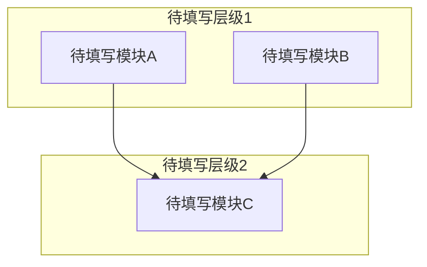

# 系统架构

<!-- GEN: 概述引导 -->
<!--
  写 2-4 句概述段落。
  逆向工程：基于对项目代码的逆向分析，本文档描述系统的实际架构。
    每个结论都附带代码证据（文件:行号）。不确定的内容标注为"待确认"并说明原因。
  正向设计：本文档描述计划中的系统架构设计。
    以下为设计意图，尚未在代码中实现。每个设计决策都应有明确的理由。
-->

## 模块划分

<!-- GEN: 模块划分引导 -->
<!--
  为每个模块写出 2-3 句职责描述。不要仅写模块名。
  "核心职责" 列说明该模块解决什么问题、对外提供什么能力。
  "复杂度概要" 列标注：代码规模（大概行数/文件数）+ 公开接口数量 + 依赖数量。
  格式示例："~500 行/8 文件，6 个公开 API，依赖 3 个模块"

  逆向工程：从实际代码目录结构和包划分中提取模块。一个大目录下的多个子目录如职责独立，可考虑拆分为子模块。
  正向设计：从架构设计的模块划分出发，可以暂未有实际目录。
-->

| 模块名 | 所属层级 | 核心职责 | 目录路径 | 依赖模块 | 复杂度概要 |
|--------|----------|----------|----------|----------|------------|
| 待填写 | 待填写 | 待填写 | 待填写 | 待填写 | 待填写 |

## 模块依赖关系图

<!-- GEN: 依赖关系图引导 -->
<!--
  必须包含模块划分表中的每一个模块。用 mermaid subgraph 按层级分组
  （表示层 / 业务逻辑层 / 数据访问层 / 基础设施层）。
  箭头方向表示依赖关系：A --> B 表示 A 依赖 B。
  逆向工程：从 import/include 语句中提取实际依赖关系。
  正向设计：画出设计中的理想依赖方向。
  如果存在循环依赖，如实画出并在"架构约束与已知例外"中说明。
  不允许使用省略号——每个模块都必须显式出现在图中。
-->

## 数据流

<!-- GEN: 数据流引导 -->
<!--
  描述项目的核心端到端数据流。数量由项目复杂度自然决定。
  每条覆盖完整链路：触发条件 → 入口模块 → 经过的模块链 → 数据形态变化 → 持久化点 → 出口/终点。
  至少覆盖 1 条读路径和 1 条写路径。仅能识别出 1 条时，说明原因。

  每条数据流用 ### 标题组织，包含以下要素：
    - 触发条件：什么事件/请求启动了这条流
    - 数据链路：模块A → 模块B → 模块C（带简要说明每一步做什么）
    - 数据形态：数据在各阶段的形式变化（如 HTTP JSON → 领域对象 → ORM 实体 → SQL）
    - 持久化：数据在哪里落地（数据库表/文件/缓存 key）

  逆向工程：通过追踪函数调用链和类型转换代码还原数据流。
  正向设计：至少描述 1 条核心业务流。
-->

### 数据流 1: 待填写

| 阶段 | 模块 | 输入形态 | 输出形态 | 说明 |
|------|------|----------|----------|------|
| 触发 | 待填写 | — | 待填写 | 待填写 |
| 处理 | 待填写 | 待填写 | 待填写 | 待填写 |
| 持久化 | 待填写 | 待填写 | 待填写 | 待填写 |
| 响应 | 待填写 | 待填写 | 待填写 | 待填写 |

### 数据流 2: 待填写

| 阶段 | 模块 | 输入形态 | 输出形态 | 说明 |
|------|------|----------|----------|------|
| 触发 | 待填写 | — | 待填写 | 待填写 |
| 处理 | 待填写 | 待填写 | 待填写 | 待填写 |
| 持久化 | 待填写 | 待填写 | 待填写 | 待填写 |
| 响应 | 待填写 | 待填写 | 待填写 | 待填写 |

## 外部依赖

<!-- GEN: 外部依赖引导 -->
<!--
  列出项目运行时依赖的所有外部系统和中间件，不包括开发工具（构建/测试工具见 02-技术选型.md）。
  按关键程度排序，关键的放前面。
  "故障影响"列：描述该依赖不可用时系统会出现什么症状。

  逆向工程：从配置文件（application.yml/.env/docker-compose.yml/package.json/Cargo.toml 等）和连接代码中提取。
  正向设计：列出设计中计划的运行时依赖。
-->

| 依赖 | 版本 | 用途 | 协议 | 关键程度 | 故障影响 |
|------|------|------|------|----------|----------|
| 待填写 | 待填写 | 待填写 | 待填写 | 高/中/低 | 待填写 |

## 技术债务

<!-- GEN: 技术债务引导 -->
<!--
  通过搜索以下模式识别技术债务，每条带具体 文件:行号 引用：
  - TODO / FIXME / HACK / XXX / OPTIMIZE 注释
  - 废弃 API 的使用
  - 被注释掉的代码块
  - 魔数（明显不应硬编码的值：超时、缓冲大小、业务常量）
  - 硬编码的 URL / IP / 端口 / 凭证
  - 空 catch 块 / 忽略返回值
  - 过深嵌套 / 过长函数

  债务数量和严重程度取决于实际代码质量——不要为了填空编造条目。
  对代码质量良好的项目，在表格下方写一段说明（如"已全文搜索 TODO/FIXME/HACK，共命中 X 条但均为已规划特性的占位注释，不属于遗留债务"）。

  每个债务项的修复建议应具体可操作。
-->

| 编号 | 债务描述 | 类型 | 影响范围 | 优先级 | 影响评估 | 修复建议 |
|------|----------|------|----------|--------|----------|----------|
| 待分析 | 待分析 | 待分析 | 待分析 | 待分析 | 待分析 | 待分析 |

## 架构约束与已知例外

<!-- GEN: 架构约束引导 -->
<!--
  记录所有有意违反分层/设计原则的地方及原因。
  搜索目标：
  - 循环依赖：A→B→A 或 A→B→C→A
  - 跨层直接调用：表示层直接访问数据访问层（跳过业务逻辑层）
  - 防腐层绕过：不应直接调用的外部系统被直接调用
  - 共享内核泄漏：多个限界上下文共享不应共享的代码

  每个条目说明：在哪里（文件:行号）、违反了什么原则、为什么是有意的、是否有修复计划。
  如果项目严格遵守分层原则，写"当前未识别架构约束违反"并简要说明架构纪律。
-->

| 编号 | 位置(文件:行号) | 违反原则 | 原因 | 计划修复 | 标记日期 |
|------|-----------------|----------|------|----------|----------|
| 待分析 | 待分析 | 待分析 | 待分析 | 待分析 | YYYY-MM-DD |

## 认知边界地图

<!-- GEN: 认知边界引导 -->
<!--
  本节仅在逆向工程模式下有意义。正向设计模式可删除或标注"不适用"。

  建立逆向分析后的知识资产负债表，区分三个层次：
  - 已知已知：通过阅读具体代码确认的事实
  - 已知未知：Agent 无法确定、需要人工补充的内容
  - 推断结论：从代码模式推断但未确认的设计决策

  已知已知验证标准：必须有至少一个具体的 文件:行号 引用。
  已知未知应写具体问题（如"身份验证机制：未找到 token 生成/验证的代码位置"），
    而非泛泛的"不确定架构是否正确"。
  推断结论的可信度：推断 = 有充分代码证据支撑的模式识别；
    推测 = 基于较少证据的猜测。
-->

### 已知已知

| 编号 | 代码证据(文件:行号) | 确认内容 | 可信度 |
|------|---------------------|----------|--------|
| 待分析 | 待分析 | 待分析 | 已确认 |

### 已知未知

| 编号 | 未知内容 | 影响 | 调查方向 |
|------|----------|------|----------|
| 待分析 | 待分析 | 待分析 | 待分析 |

### 推断结论

| 编号 | 推断内容 | 证据 | 可信度 |
|------|----------|------|--------|
| 待分析 | 待分析 | 待分析 | 推断 / 推测 |

---

<!--
  生成后自检：
  - [ ] front matter 的 mode/source/confidence 已正确填写
  - [ ] 每个表格至少有一行非占位数据
  - [ ] 模块依赖关系图包含模块划分表中的所有模块
  - [ ] 数据流覆盖了核心业务闭环（至少 1 条读 + 1 条写路径）
  - [ ] 外部依赖表涵盖所有运行时依赖
  - [ ] 技术债务节已实际搜索代码
  - [ ] 认知边界地图三个子表已填写（逆向工程模式）
  - [ ] 没有任何表格行全为"待填写/待分析"而不给出理由
  - [ ] 无 "..." 占位符
-->
