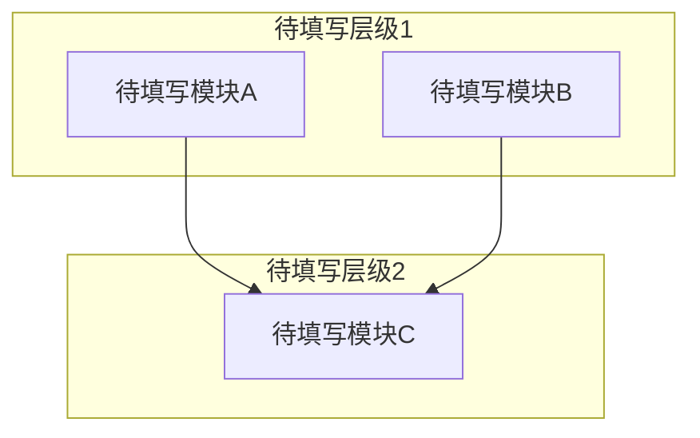

# 系统架构

<!-- GEN: 概述引导 -->
<!--
  写 2-4 句概述段落。
  逆向工程：基于对项目代码的逆向分析，本文档描述系统的实际架构。
    每个结论都附带代码证据（文件:行号）。
  正向设计：本文档描述计划中的系统架构设计。
    以下为设计意图，尚未在代码中实现。每个设计决策都应有明确的理由。-->

## 模块划分

<!-- GEN: 模块划分引导 -->
<!--
  为每个模块写出 2-3 句职责描述。不要仅写模块名。
  "核心职责" 列说明该模块解决什么问题、对外提供什么能力。
  "复杂度概要" 列标注：代码规模（大概行数/文件数）+ 公开接口数量 + 依赖数量。
  格式示例："~500 行/8 文件，6 个公开 API，依赖 3 个模块"

  逆向工程：从实际代码目录结构和包划分中提取模块。
  正向设计：从架构设计的模块划分出发，可以暂未有实际目录。-->

| 模块名 | 所属层级 | 核心职责 | 目录路径 | 依赖模块 | 复杂度概要 |
|--------|----------|----------|----------|----------|------------|
| 待填写 | 待填写 | 待填写 | 待填写 | 待填写 | 待填写 |

## 模块依赖关系图

<!-- GEN: 依赖关系图引导 -->
<!--
  必须包含模块划分表中的每一个模块。用 mermaid subgraph 按层级分组
  （表示层 / 业务逻辑层 / 数据访问层 / 基础设施层）。
  箭头方向表示依赖关系：A --> B 表示 A 依赖 B。
  逆向工程：从 import/include 语句中提取实际依赖关系。
  正向设计：画出设计中的理想依赖方向。
  如果存在循环依赖，如实画出——循环依赖条目写入 04-问题与改进.md > 架构违规。
  不允许使用省略号——每个模块都必须显式出现在图中。-->

## 数据流

<!-- GEN: 数据流引导 -->
<!--
  描述项目的核心端到端数据流。数量由项目复杂度自然决定。
  每条覆盖完整链路：触发条件 → 入口模块 → 经过的模块链 → 数据形态变化 → 持久化点 → 出口/终点。
  至少覆盖 1 条读路径和 1 条写路径。仅能识别出 1 条时，说明原因。

  每条数据流用 ### 标题 + 有序列表组织，不使用表格。
  逆向工程：通过追踪函数调用链和类型转换代码还原数据流。
  正向设计：至少描述 1 条核心业务流。-->

### 数据流 1: 待填写

**触发**：待填写（什么事件/请求启动了这条流）

**链路**：
1. **模块A** — 做什么
2. **模块B** — 做什么
3. **模块C** — 做什么

**数据形态变化**：待填写 → 待填写 → 待填写

**持久化点**：待填写（数据库表/文件/缓存 key）

### 数据流 2: 待填写

**触发**：待填写

**链路**：
1. **模块A** — 做什么
2. **模块B** — 做什么

**数据形态变化**：待填写 → 待填写

**持久化点**：待填写

## 外部依赖

<!-- GEN: 外部依赖引导 -->
<!--
  列出项目运行时依赖的所有外部系统和中间件，不包括开发工具（构建/测试工具见 02-技术选型.md）。
  按关键程度排序，关键的放前面。
  "故障影响"列：描述该依赖不可用时系统会出现什么症状。

  逆向工程：从配置文件和连接代码中提取。版本/协议等详细信息见 02-技术选型.md。-->

| 依赖 | 用途 | 关键程度 | 故障影响 |
|------|------|----------|----------|
| 待填写 | 待填写 | 高/中/低 | 待填写 |

## 认知边界地图

<!-- GEN: 认知边界引导 -->
<!--
  本节仅在逆向工程模式下有意义。正向设计模式可删除或标注"不适用"。

  建立逆向分析后的知识资产负债表，区分三个层次：
  - 已知已知：通过阅读具体代码确认的事实
  - 已知未知：Agent 无法确定、需要人工补充的内容
  - 推断结论：从代码模式推断但未确认的设计决策

  已知已知验证标准：必须有至少一个具体的 文件:行号 引用。
  已知未知应写具体问题（如"身份验证机制：未找到 token 生成/验证的代码位置"）。
  推断结论的可信度：推断 = 有充分代码证据支撑；推测 = 基于较少证据的猜测。-->

### 已知已知

| 编号 | 代码证据(文件:行号) | 确认内容 |
|------|---------------------|----------|
| 待分析 | 待分析 | 待分析 |

### 已知未知

| 编号 | 未知内容 | 影响 | 调查方向 |
|------|----------|------|----------|
| 待分析 | 待分析 | 待分析 | 待分析 |

### 推断结论

| 编号 | 推断内容 | 证据 |
|------|----------|------|
| 待分析 | 待分析 | 待分析 |

---

<!--
  Agent 机械自检（以下项 Agent 可自信验证）：
  - [ ] front matter 字段非空且值在允许集合内
  - [ ] 每个表格至少有一行非占位数据
  - [ ] 模块依赖关系图包含模块划分表中的所有模块
  - [ ] 外部依赖表涵盖所有运行时依赖（版本/协议细节 → 02）
  - [ ] 认知边界地图三个子表已填写（逆向工程模式）
  - [ ] 无 "..." 占位符

  深度自检（定性追问，Agent 生成完成后逐项回答）：
  - [ ] **数据流覆盖**：列出系统所有主要用户操作，是否每个主要操作都有独立的数据流追踪？如有操作缺少追踪，在文档中说明原因
  - [ ] **模块粒度**：是否存在一个"模块"包含了分属不同架构层级的类（如 View 和 Model 混在同一个模块中）？如有，是否有明确的合并理由？
  - [ ] **认知边界四维度**："已知未知"子表中是否至少包含以下维度的未知项：架构决策理由 / 未实现功能的预期行为 / 外部依赖的内部实现 / 性能约束的来源？如某维度为空，确认是否真的全部已知

  语义质量项（数据流完整性、认知准确性等）
  由阶段 2 SOP 的人类确认清单覆盖，不在此自检。
-->
