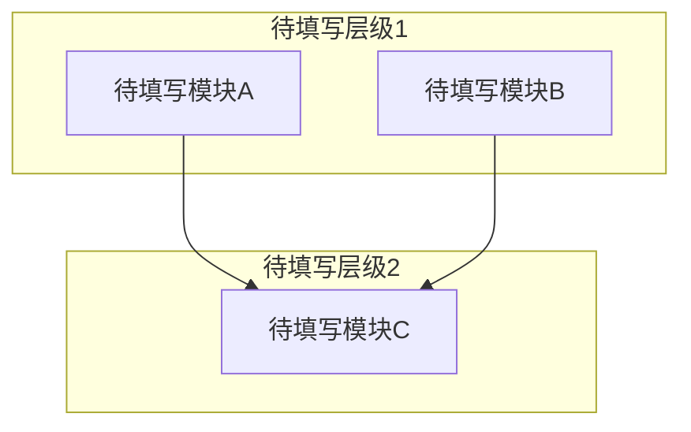

# 系统架构

<!-- GEN: 概述引导 -->
<!--
  根据当前 mode 写 2-4 句概述段落：
  - reverse：基于对项目代码的逆向分析，本文档描述系统的实际架构。
    内容均从代码中提取，未反映设计意图（除非标注为"推断结论"）。
    每个结论都应附带代码证据（文件:行号），不确定的内容标记为"待确认"。
  - greenfield：本文档描述计划中的系统架构设计。
    以下为设计意图，尚未在代码中实现。每个设计决策都应有明确的理由。
-->

## 模块划分

<!-- GEN: 模块划分引导 -->
<!--
  为每个模块写出 2-3 句的职责描述，不要仅写模块名。
  "核心职责" 列需说明该模块解决什么问题、对外提供什么能力。
  "复杂度概要" 列需标注代码规模（行数/文件数）+ 公开接口数量 + 依赖数量，
  为后续文档编写工作量提供参考。
  reverse 模式：从实际代码目录结构和 package 划分中提取模块。
    如果某个目录下代码过多（>20 文件），考虑拆分为子模块。
  greenfield 模式：从架构设计的模块划分出发，可以暂未有实际目录。
  不允许留空行——每个模块都必须填写完整，暂不确定的填"待确认"。
-->

| 模块名 | 所属层级 | 核心职责 | 目录路径 | 依赖模块 | 复杂度概要 |
|--------|----------|----------|----------|----------|------------|
| 待填写 | 待填写 | 待填写 | 待填写 | 待填写 | 待填写 |

## 模块依赖关系图

<!-- GEN: 依赖关系图引导 -->
<!--
  必须包含上方模块划分表中的每一个模块。用 mermaid subgraph 按层级分组
  （如：表示层 / 业务逻辑层 / 数据访问层 / 基础设施层）。
  箭头方向表示依赖关系：A --> B 表示 A 依赖 B。
  reverse 模式：从 import/include 语句中提取实际依赖关系。
  greenfield 模式：画出设计中的理想依赖方向。
  如果存在循环依赖，也要如实画出（在"架构约束与已知例外"中说明原因）。
  不允许使用省略号 "..."，每个模块都必须显式出现在图中。
-->

## 数据流

<!-- GEN: 数据流引导 -->
<!--
  描述 2-5 条主要端到端数据流。每条覆盖完整链路：
  触发条件 -> 入口模块 -> 经过的模块链 -> 数据形态变化 -> 持久化点 -> 出口/终点。
  每条数据流用一个 ### 标题，包含以下要素：
    - 触发条件：什么事件/请求启动了这条流
    - 数据链路：模块A -> 模块B -> 模块C（带简要说明每一步做什么）
    - 数据形态：数据在各阶段的形式变化（如：HTTP JSON -> 领域对象 -> ORM 实体 -> SQL）
    - 持久化：数据在哪里落地（数据库表/文件/缓存 key）
  reverse 模式：通过追踪函数调用链和类型转换代码来还原数据流。
    至少标注 1 条读路径和 1 条写路径。
  greenfield 模式：至少描述 1 条核心业务流和 1 条最重要的系统控制流。
-->

### 数据流 1: 待填写

| 阶段 | 模块 | 输入形态 | 输出形态 | 说明 |
|------|------|----------|----------|------|
| 触发 | 待填写 | — | 待填写 | 待填写 |
| 处理 | 待填写 | 待填写 | 待填写 | 待填写 |
| 持久化 | 待填写 | 待填写 | 待填写 | 待填写 |
| 响应 | 待填写 | 待填写 | 待填写 | 待填写 |

### 数据流 2: 待填写

| 阶段 | 模块 | 输入形态 | 输出形态 | 说明 |
|------|------|----------|----------|------|
| 触发 | 待填写 | — | 待填写 | 待填写 |
| 处理 | 待填写 | 待填写 | 待填写 | 待填写 |
| 持久化 | 待填写 | 待填写 | 待填写 | 待填写 |
| 响应 | 待填写 | 待填写 | 待填写 | 待填写 |

## 外部依赖

<!-- GEN: 外部依赖引导 -->
<!--
  列出项目运行时依赖的所有外部系统和中间件，不包括开发工具（构建/测试工具见 02-技术选型.md）。
  按"关键程度"排序，关键的放前面。
  "故障影响"列：描述该依赖不可用时系统会出现什么症状，帮助运维快速定位问题。
  reverse 模式：从配置文件（application.yml/.env/pom.xml/package.json/Cargo.toml 等）、
    docker-compose.yml、README 中提取运行时外部依赖。
  greenfield 模式：列出设计中计划的运行时依赖，版本可能未最终确定。
-->

| 依赖 | 版本 | 用途 | 协议 | 关键程度 | 故障影响 |
|------|------|------|------|----------|----------|
| 待填写 | 待填写 | 待填写 | 待填写 | 高/中/低 | 待填写 |

## 技术债务

<!-- GEN: 技术债务引导 -->
<!--
  通过搜索以下模式识别技术债务，每条必须包含具体文件:行号引用：
  - TODO / FIXME / HACK / XXX / OPTIMIZE 注释
  - 废弃 API 的使用（deprecated）
  - 被注释掉的代码块
  - 魔数（magic numbers）——关注明显不应硬编码的值：超时时间、缓冲区大小、业务常量
  - 硬编码的 URL / IP / 端口 / 凭证
  - 缺失的错误处理（空 catch 块、忽略返回值）
  - 过深的嵌套 / 过长的函数
  债务数量和严重程度取决于实际代码质量，不要为了填空而编造条目。
  对于代码质量良好的项目，在表格下方写"当前未识别明显技术债务"并简要说明判断依据
  （如："已全文搜索 TODO/FIXME/HACK，共命中 X 条但均为已规划特性的占位注释，不属于遗留债务"）。
  "优先级"用 高/中/低，"影响评估"描述不修复会导致什么实际问题。
  "修复建议"给出具体可操作的方向，而非泛泛而谈。
-->

| 编号 | 债务描述 | 债务类型 | 影响范围 | 优先级 | 影响评估 | 修复建议 |
|------|----------|----------|----------|--------|----------|----------|
| 待分析 | 待分析 | 待分析 | 待分析 | 待分析 | 待分析 | 待分析 |

## 架构约束与已知例外

<!-- GEN: 架构约束引导 -->
<!--
  记录所有有意违反分层/设计原则的地方及原因。
  搜索目标：
  - 循环依赖：A 依赖 B 且 B 依赖 A（或 A -> B -> C -> A）
  - 跨层直接调用：表示层直接访问数据访问层（跳过业务逻辑层）
  - 防腐层绕过：不应该直接调用的外部系统被直接调用
  - 共享内核泄漏：多个限界上下文共享不应共享的代码
  - 不应该存在的双向依赖
  每个条目必须说明：在哪里（文件:行号）、违反了什么原则、
  为什么是有意的（而非错误）、是否有计划修复。
  如果项目严格遵守分层原则，写"当前未识别架构约束违反"并简要说明架构纪律。
-->

| 编号 | 位置(文件:行号) | 违反原则 | 原因 | 计划修复 | 标记日期 |
|------|-----------------|----------|------|----------|----------|
| 待分析 | 待分析 | 待分析 | 待分析 | 待分析 | YYYY-MM-DD |

## 认知边界与债务地图

<!-- GEN: 认知边界引导 -->
<!--
  模式说明：本节仅在 reverse 模式下有意义。greenfield 模式下可删除本节或标注 N/A。

  本节建立逆向分析后的"知识资产负债表"，明确区分：
  - 已知已知：通过阅读具体代码确认的事实
  - 已知未知：AI 无法确定、需要人工补充的内容
  - 推断结论：从代码模式推断但未确认的设计决策

  "已知已知"验证标准：必须有至少一个具体的文件:行号引用。没有代码证据的内容不应放入此表。
  "已知未知"应写具体问题，如"身份验证机制：未找到 token 生成/验证的代码位置"，
    而非"不确定架构是否正确"。
  "推断结论"的置信度：INFERRED = 有充分代码证据支撑的模式识别；
    SPECULATIVE = 基于较少证据的猜测。
-->

### 已知已知（Confirmed Understanding）

| 编号 | 代码证据(文件:行号) | 确认内容 | 置信度 |
|------|---------------------|----------|--------|
| 待分析 | 待分析 | 待分析 | confirmed |

### 已知未知（Recognized Gaps）

| 编号 | 未知内容 | 影响 | 调查方向 |
|------|----------|------|----------|
| 待分析 | 待分析 | 待分析 | 待分析 |

### 推断结论（Inferred Architecture）

| 编号 | 推断内容 | 证据 | 置信度 |
|------|----------|------|--------|
| 待分析 | 待分析 | 待分析 | inferred / speculative |

## 架构决策记录 (ADR) 索引

<!-- GEN: 架构决策记录引导 -->
<!--
  reverse 模式：从代码中识别架构层面的决策（选择的框架、分层方式、通信模式等），
    填入下表并标记为 INFERRED。每个决策需有代码证据支撑。
    例如：从 controllers/ 目录和 services/ 目录的分离推断出采用分层架构。
  greenfield 模式：此表作为 ADR 索引，指向 .ai/changes/ 下的详细 ADR 文档。
    每个 ADR 记录一次重要的架构决策（Why, What, Alternatives Considered, Consequences）。
    如果尚未创建 ADR，标注"待创建"。
  状态：accepted（已采纳）/ proposed（提议中）/ superseded（已被替代）/ deprecated（已废弃）
-->

| ADR编号 | 决策 | 证据/来源 | 推断理由 | 状态 |
|---------|------|-----------|----------|------|
| 待填写 | 待填写 | 待填写 | 待填写 | 待填写 |

---

<!--
  完整性检查清单（AI 在生成后应自检）：
  - [ ] front matter 中 mode/source/confidence 已正确填写
  - [ ] 每个表格至少有一行非占位数据（或明确标注"待确认"的理由）
  - [ ] 模块依赖关系图中包含模块划分表中的所有模块
  - [ ] 数据流至少 2 条，每条覆盖完整链路（触发->处理->持久化->响应）
  - [ ] 外部依赖表涵盖所有运行时依赖（不含开发工具）
  - [ ] 技术债务节已实际搜索代码（搜索了 TODO/FIXME/HACK/deprecated/硬编码 等关键词）
  - [ ] reverse 模式下，"认知边界与债务地图"的三个子表已填写
  - [ ] ADR 索引至少有一条记录或无 ADR 的说明
  - [ ] 没有任何表格行全为"待填写"而不给出理由
-->
