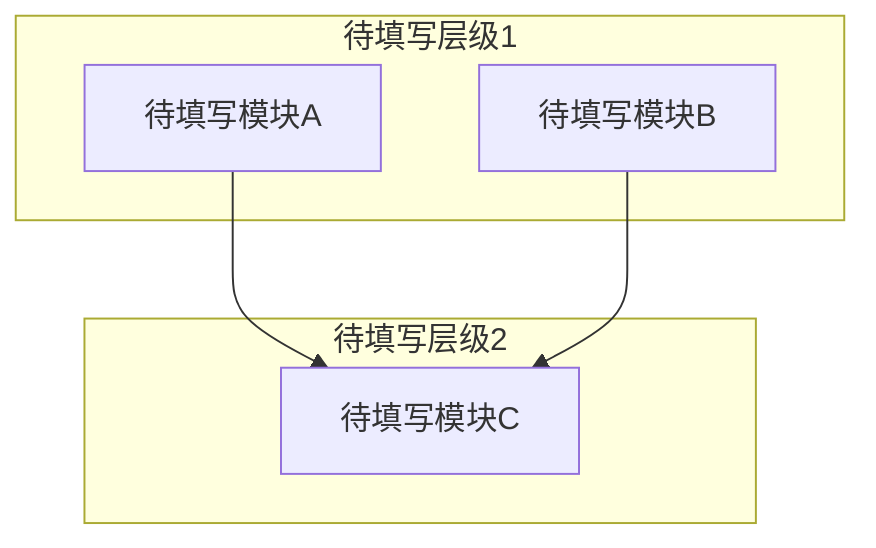

# 系统架构

<!-- 概述引导 -->
<!--
  写 2-4 句概述段落，描述系统的整体架构。
  每个结论都附带代码证据，使用符号锚点格式：
    ClassName::methodName()  或  filename.cpp → functionName()
-->

## 模块划分

<!-- 模块划分引导 -->
<!--
  本引导用于逆向现有代码并生成架构文档。分为两个阶段：
  1. 模块发现（从代码中产出候选模块）
  2. 模块评估（对每个模块进行描述、内聚性校验与权重打分）

  ═══════════════════════════════════════════════════════════
  一、模块发现启发式（逆向工程第一步）
  → 执行规则见阶段2 SOP「模块发现启发式」
  仅在此处列出最终确定的模块。

  ═══════════════════════════════════════════════════════════
  二、模块职责描述
  ═══════════════════════════════════════════════════════════
  为每个模块写出 2-3 句职责描述，说明该模块解决什么问题、对外提供什么能力。
  不要仅写模块名，避免"UserManager"这类空洞命名。

  ═══════════════════════════════════════════════════════════
  三、模块命名规则
  模块名不得使用"与/和/及"连接不相关的概念。
  → 合并条件与例外规则见阶段5 SOP「步骤0：模块分组方案」
  ═══════════════════════════════════════════════════════════
  四、综合权重评估
  每个模块从7个维度给出1-5分。综合权重 = 七维评分之和（范围 7~35 分）。
  → 评分锚点标准见阶段5 SOP「综合权重评估规则」
  ═══════════════════════════════════════════════════════════
  五、复杂度概要格式
  格式："~行数/文件数，M 个公开 API，依赖 N 个模块"
-->

| 模块名 | 所属层级 | 核心职责 | 目录路径 | 依赖模块 | 复杂度概要 | 综合权重 |
|--------|----------|----------|----------|----------|------------|----------|
| 待填写 | 待填写 | 待填写 | 待填写 | 待填写 | 待填写 | 待填写 |

## 模块依赖关系图

<!-- 依赖关系图引导 -->
<!--
  仅包含项目内部模块——不画出 Qt、SQLite 等外部库节点。外部依赖在"外部依赖"表格中描述。
  必须包含模块划分表中的每一个模块。用 mermaid subgraph 按层级分组。
  箭头方向表示依赖关系：A --> B 表示 A 依赖 B。
  → 绘制规则见阶段2 SOP步骤4。不允许使用省略号——每个模块都必须显式出现在图中。
-->

## 数据流

<!-- 数据流引导 -->
<!--
  描述项目的核心端到端数据流。数据流分为两个层级：
  - L1（本文档）：跨模块数据流，以模块为粒度，每个步骤 = "模块A → 模块B"
  - L2（03-详细设计）：模块内部业务流程
  → L1/L2边界规则及排查角度见阶段2 SOP步骤2。

  每个数据流步骤必须使用符号锚点格式：
    ClassName::methodName()  或  filename.cpp → functionName()
  每条数据流用 ### 标题 + 有序列表组织，不使用表格。
-->

### 数据流 1: 待填写

**触发**：待填写（什么事件/请求启动了这条流）

**链路**：
1. **模块A** `ModuleA::entryPoint()` — 做什么
2. **模块B** `ModuleB::processData()` — 做什么
3. **模块C** `ModuleC::persist()` — 做什么

**数据形态变化**：待填写 → 待填写 → 待填写

**持久化点**：待填写（数据库表/文件/缓存 key）

### 数据流 2: 待填写

**触发**：待填写

**链路**：
1. **模块A** `ModuleA::query()` — 做什么
2. **模块B** `ModuleB::format()` — 做什么

**数据形态变化**：待填写 → 待填写

**持久化点**：待填写

## 外部依赖

<!-- 外部依赖引导 -->
<!--
  列出项目运行时依赖的所有外部系统和中间件，不包括开发工具（构建/测试工具见 02-决策记录.md）。
  按关键程度排序，关键的放前面。
  "故障影响"列：描述该依赖不可用时系统会出现什么症状。
-->

| 依赖 | 用途 | 关键程度 | 故障影响 |
|------|------|----------|----------|
| 待填写 | 待填写 | 高/中/低 | 待填写 |

## 认知边界地图

<!-- 认知边界引导 -->
<!--
  建立知识资产负债表，区分三个层次：
  - 已知已知：通过阅读具体代码确认的事实
  - 已知未知：Agent 无法确定、需要人工补充的内容
  - 推断结论：从代码模式推断但未确认的设计决策

  → 各层次的验证标准见阶段2 SOP步骤7。
-->

### 已知已知

| 编号 | 代码证据（符号锚点） | 确认内容 |
|------|----------------------|----------|
| 待分析 | 待分析 | 待分析 |

### 已知未知

| 编号 | 未知内容 | 影响 | 调查方向 |
|------|----------|------|----------|
| 待分析 | 待分析 | 待分析 | 待分析 |

### 推断结论

| 编号 | 推断内容 | 证据 |
|------|----------|------|
| 待分析 | 待分析 | 待分析 |

---

<!--
  Agent 格式自检（格式级，执行规则见阶段2 SOP「产出后自检」）：
  - [ ] front matter 字段非空且值在允许集合内
  - [ ] 每个表格至少有一行非占位数据
  - [ ] 无 "..." 占位符
  - [ ] 无 "待填写" 残留
  - [ ] 模块命名符合规则（见阶段5 SOP合并条件）
-->
