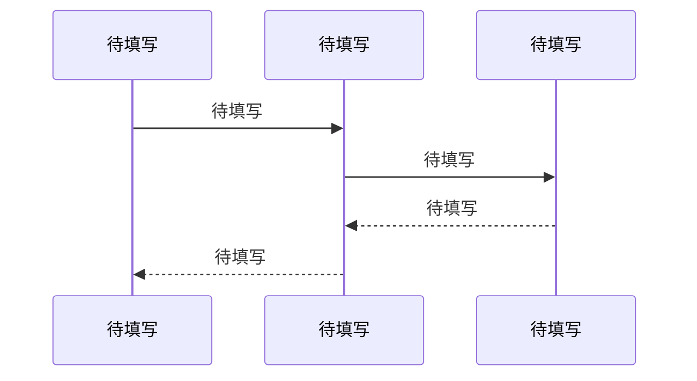

<!-- GEN: 模式说明 -->
<!--
  本模板服务于两种模式：
  - reverse（逆向）：通过对模块代码的逆向分析生成，描述模块的实际实现结构和行为。
    每个关键声明必须标注置信度（CONFIRMED / INFERRED / SPECULATIVE）。
    不确定的细节标注"待确认"并解释原因，不得跳过。
  - greenfield（正向）：定义模块的计划设计，作为编码的契约。
    所有 API 契约、数据模型、业务流程均为设计意图。

  深度原则：深度由模块自身复杂度自然决定。复杂模块（多 API、多数据实体、复杂业务流程）
  自然产出长文档；简单模块（少量函数、无持久化、无状态）自然产出短文档。

  必填章节：异常处理、并发安全、性能特征三个专题必须全部填写。
  如模块不涉及某个专题，写明"不适用"并解释原因，不得跳过。
-->

# 待填写 详细设计
## 概述

<!-- GEN: 概述引导 -->
<!--
  写 3-5 句概述。
  必须包含：
  1. 核心职责的一句话精确定义
  2. 在系统中的定位（引用 00-架构.md 依赖图中的位置）
  3. 负向限制（本模块绝对不做什么，2-5 条）

  负向限制示例：
  - "本模块不直接操作数据库连接，所有持久化通过 Repository 接口完成"
  - "本模块不处理用户认证，认证状态由上游调用方传入"
  - "本模块不发起对外部服务的网络请求"

  反向模式：补充一段关于模块设计意图的推断（标记 INFERRED），
  基于代码中的设计模式、命名约定、结构组织来推断。
-->

**核心职责**：待填写

**系统定位**：待填写

**负向限制**：
- 待填写
- 待填写

**设计意图推断**（reverse 模式，标记 INFERRED）：
待填写

## 核心数据模型

<!-- GEN: 数据模型引导 -->
<!--
  列出本模块拥有的所有核心实体和关键字段。不要省略字段。
  每个字段必须填写所有列。reverse 模式下增加"置信度"列。
  只列核心实体——完整字段列表以代码为准，文档做提炼和语义说明。
  对于外部引用的实体（非本模块拥有），只列与本模块相关的关键字段。

  必须包含：
  - 实体间关系的文字说明
  - 关键数据约束和校验规则（从代码中的 validation、check constraint 等提取）
-->

### 待填写

| 字段 | 类型 | 约束 | 默认值 | 含义 | 置信度 | 证据 |
|------|------|------|--------|------|--------|------|
| 待填写 | 待填写 | 待填写 | 待填写 | 待填写 | CONFIRMED | 待填写 |

### 待填写

| 字段 | 类型 | 约束 | 默认值 | 含义 | 置信度 | 证据 |
|------|------|------|--------|------|--------|------|
| 待填写 | 待填写 | 待填写 | 待填写 | 待填写 | 待填写 | 待填写 |

**实体关系**：待填写

**关键约束**：
- 待填写
- 待填写

## 对外接口契约

<!-- GEN: 接口契约引导 -->
<!--
  记录本模块所有对外公开的 API 端点或函数。
  不列内部辅助函数。每个端点/函数必须完整填写。

  每个 API 必须包含：
  - 请求参数（所有参数，含类型、必填/可选、默认值、验证规则）
  - 成功响应格式
  - 所有已知错误码（含触发条件）
  - 副作用说明：该 API 会读写哪些全局状态（数据库表、缓存、消息队列、文件系统）
  - 幂等性设计：如果有幂等性保证，说明机制并附代码证据；如果没有，说明原因或标记为潜在风险

  reverse 模式：每个参数和错误码标注置信度。
  greenfield 模式：这是需要实现的目标契约。
-->

### 待填写

- **方法**：GET / POST / PUT / DELETE
- **路径**：`/api/xxx`
- **认证**：无 / Bearer Token / Basic Auth / 待填写

**请求参数**：

| 参数 | 类型 | 必填 | 默认值 | 验证规则 | 说明 | 置信度 |
|------|------|------|--------|----------|------|--------|
| 待填写 | 待填写 | 是/否 | 待填写 | 待填写 | 待填写 | CONFIRMED |

**成功响应**：

```json
{
  "field": "type"
}
```

**错误码**：

| 状态码 | 错误码 | 触发条件 | 置信度 |
|--------|--------|----------|--------|
| 400 | 待填写 | 待填写 | CONFIRMED |

**副作用**：待填写

**幂等性设计**：待填写

### 待填写

- **方法**：待填写
- **路径**：待填写
- **认证**：待填写

**请求参数**：

| 参数 | 类型 | 必填 | 默认值 | 验证规则 | 说明 | 置信度 |
|------|------|------|--------|----------|------|--------|
| 待填写 | 待填写 | 待填写 | 待填写 | 待填写 | 待填写 | 待填写 |

**成功响应**：

```json
```

**错误码**：

| 状态码 | 错误码 | 触发条件 | 置信度 |
|--------|--------|----------|--------|
| 待填写 | 待填写 | 待填写 | 待填写 |

**副作用**：待填写

**幂等性设计**：待填写

## 核心业务流程

<!-- GEN: 业务流程引导 -->
<!--
  至少 1 个核心业务流程。
  使用 Mermaid sequenceDiagram 或 flowchart，节点使用实际函数名/模块名。
  图后用表格描述每个步骤：操作、执行者（类/函数名）、代码位置、该步骤的异常处理。
  如果模块无复杂流程（纯数据/工具模块），写明原因。
-->



**流程说明**：

| 步骤 | 操作 | 执行者 | 代码位置 | 异常处理 |
|------|------|--------|----------|----------|
| 1 | 待填写 | 待填写 | 待填写 | 待填写 |

## 状态机（如适用）

<!-- GEN: 状态机引导 -->
<!--
  如果本模块管理有生命周期状态流转的实体，填写完整的状态机。
  每行：当前状态、触发事件、目标状态、守卫条件、副作用。
  如果没有状态机，删除整个章节，不要留空表。
-->

| 当前状态 | 触发事件 | 目标状态 | 守卫条件 | 副作用 |
|----------|----------|----------|----------|--------|
| 待填写 | 待填写 | 待填写 | 待填写 | 待填写 |

---

## 异常处理与容错策略

<!-- GEN: 异常处理引导 -->
<!--
  此章节必须填写。如果模块确实没有异常处理代码，写明
  "本模块未发现异常处理代码，存在安全隐患" 并标记为技术债务。

  搜索目标：
  - try-catch 块的位置和覆盖范围
  - 自定义异常类的定义和使用
  - 全局错误处理器的注册和逻辑
  - 错误响应格式的统一约定
  - 降级逻辑（如某服务不可用时的 fallback）
  - 超时配置和重试策略
  - 熔断器的使用

  每个发现都要有代码位置引用。
-->

**已知异常域**：待填写

**异常处理策略**：

| 异常/错误场景 | 处理策略 | 代码位置 | 是否充分 |
|--------------|----------|----------|----------|
| 待填写 | 待填写 | 待填写 | 是/否/待评估 |

**降级与兜底逻辑**：待填写

**错误码约定**：待填写

---

## 并发安全与一致性保证

<!-- GEN: 并发安全引导 -->
<!--
  此章节必须填写。
  如果模块无共享状态（纯函数、无状态工具），写明
  "本模块为无状态工具/函数模块，不涉及共享状态，无并发风险"。

  搜索目标：
  - 锁机制（synchronized / Lock / mutex / 分布式锁）
  - 事务边界（@Transactional / BEGIN...COMMIT / 事务管理器）
  - 事务隔离级别配置
  - 原子操作（AtomicInteger / compareAndSet / 数据库原子更新）
  - 并发集合（ConcurrentHashMap / CopyOnWriteArrayList）
  - volatile 变量的使用
  - 乐观锁（version 字段 / CAS 操作）

  每个发现都要有代码位置引用。如果代码中没有并发保护但存在共享资源，
  标记为"潜在并发安全问题"。
-->

**并发风险点**：

| 风险点 | 保护机制 | 作用范围 | 代码证据 | 潜在缺口 |
|--------|----------|----------|----------|----------|
| 待填写 | 待填写 | 待填写 | 待填写 | 待填写 |

**锁与事务机制**：待填写

**线程安全评估**：待填写

---

## 性能特征与资源消耗

<!-- GEN: 性能特征引导 -->
<!--
  此章节必须填写。
  如果模块非常简单（纯计算、无 I/O、无循环），写明原因。

  搜索目标：
  - 核心算法的时间/空间复杂度
  - 缓存策略（本地缓存、分布式缓存、缓存失效策略、防缓存穿透）
  - 数据库查询模式（N+1 风险、批量操作、连接池配置）
  - 大对象/大集合的内存占用
  - 外部调用的 I/O 密集度
  - 资源池（连接池、线程池）的配置和使用
-->

**核心路径复杂度**：待填写

**缓存策略**：

| 缓存目标 | 缓存方式 | 失效策略 | 代码位置 | 穿透风险 |
|----------|----------|----------|----------|----------|
| 待填写 | 待填写 | 待填写 | 待填写 | 待填写 |

**查询模式**：待填写

**资源密集点**：待填写

---

## 已知问题与陷阱

<!-- GEN: 已知问题引导 -->
<!--
  记录本模块在代码中发现的具体问题。
  每个条目都要有：问题的具体描述、严重程度、可能触发场景、当前的临时规避方式。
  来源：TODO 注释、FIXME 标记、硬编码常量、看起来可疑的变通实现、已知 bug。
  greenfield 模式：此章节变为"设计决策与取舍"，记录有意的设计权衡。
-->

| 编号 | 描述 | 严重程度 | 触发场景 | 当前规避方式 |
|------|------|----------|----------|-------------|
| 待填写 | 待填写 | 高/中/低 | 待填写 | 待填写 |

---

## 模块接口图

<!-- GEN: 接口图引导 -->
<!--
  用表格清晰展示本模块的接口边界。
  对外提供：本模块暴露给外部的接口（API、事件、导出类型/函数）
  依赖消费：本模块使用的外部接口（来自其他模块或第三方）
  稳定性评估：接口变更频率的预期（稳定/偶尔调整/频繁变更）
-->

### 对外提供

| 接口 | 类型 | 消费者 | 稳定性 |
|------|------|--------|--------|
| 待填写 | API / Event / Export | 待填写 | 稳定 / 偶尔调整 |

### 依赖消费

| 接口 | 类型 | 提供者 | 关键程度 |
|------|------|--------|----------|
| 待填写 | API / Library / Service | 待填写 | 核心 / 辅助 |

---

<!--
  完整性自检清单（AI 在生成后应自检）：
  - [ ] front matter 中 mode / source / confidence 已正确填写
  - [ ] 概述包含核心职责精确定义 + 负向限制（至少 2 条）
  - [ ] 数据模型列出了所有核心实体和关键字段，无不合理的省略
  - [ ] API 契约每个端点含副作用和幂等性说明
  - [ ] 至少 1 个核心业务流程图（使用实际函数名）
  - [ ] 异常处理与容错策略章节已填写（或标注"存在安全隐患"）
  - [ ] 并发安全与一致性保证章节已填写（或标注"不适用"并写明原因）
  - [ ] 性能特征与资源消耗章节已填写（或标注"不适用"并写明原因）
  - [ ] 无 "..." 占位符
  - [ ] 每个声明在 reverse 模式下标注了置信度
-->
