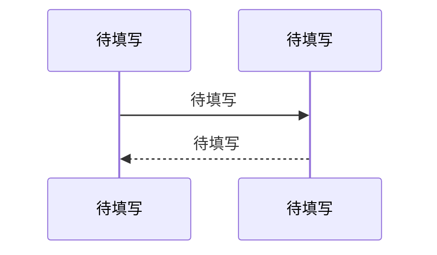

> **📋 本文档角色**
>
> **定位**：单个模块的详细设计。记录数据模型、API 契约、业务流程、异常处理、并发安全和性能特征。
>         深度由模块权重和内容条件共同决定。
>
> **读者**：AI（执行会话，如 sdd-apply 的 implementer）
>
> **应该写**：
> - 概述（核心职责精确定义、系统定位、权重评估、负向限制、设计决策关联 → D-XXX）
> - 核心数据模型（实体字段表、约束、实体关系）
> - 对外接口契约（每个公开 API：签名、参数、返回值、副作用、幂等性）
> - 核心业务流程（Mermaid 序列图，使用实际函数名/模块名）
> - 状态机（如有生命周期状态流转的实体）
> - 异常处理与容错（try-catch/降级/重试/超时/熔断）
> - 并发安全（共享状态保护机制、风险点）
> - 性能特征（复杂度、资源密集点）
>
> **不应该写**：
> - 需求动机（"因为用户需要..."）→ 归入 02
> - 全局架构判断（"这个模块应该拆分为两个"）→ 归入 00 或 04
> - 模块陷阱（"使用者需要注意..."）→ 归入 04 MT 条目，不在模块文档中重复
> - 设计决策理由的完整展开 → 引 D-XXX，理由本身只在 02 中存在
>
> **写入者**：ai-sdd-reverse 阶段5 / sdd-sync（增量更新）
>
> ---

<!-- GEN: 章节规则 -->
<!--
  章节展开由"权重建议 + 内容条件"双因素决定。
  → 权重评估、内容条件表、决策流程见阶段5 SOP「深度决定规则」。
  → 章节编写顺序（强制）见阶段5 SOP「章节编写顺序」。
  → God Class 处理规则见阶段5 SOP「God Class 必须单独成文」。

  God Class 文档标注格式：概述中标注 "⚠️ God Class"，按职责拆分子节（3-5个）。

  各章节"不涉及"时的标准措辞：
    核心业务流程 → "本模块无多步骤业务流程。"
    状态机 → "本模块不管理有生命周期状态流转的实体。"
    异常处理与容错 → "本模块无异常处理逻辑。"
    并发安全 → "本模块无共享状态，无并发风险。"
    性能特征 → "本模块无性能敏感路径。"
-->

# 待填写 详细设计

## 概述

<!-- GEN: 概述引导 -->
<!--
  必须包含：
  1. 核心职责的一句话精确定义
  2. 在系统中的定位（引用 00-架构.md 依赖图中的位置）
  3. 负向限制：如实列出模块明确不做什么。模块确实没有明确边界时写"未识别明确的负向限制"。
     本模块绝对不做什么。列出代码中实际可识别的条目。
  4. 设计决策关联：列出本模块涉及的关键 D-XXX 决策编号（一行一句简介）。
     如 02-决策记录.md 中缺少对应的决策条目 → 先补充到 02，再在此处关联。
     禁止在此处重复展开决策理由——理由只在 02 中存在一份。-->

**核心职责**：待填写

**系统定位**：待填写

**负向限制**：
- 待填写

**设计决策关联**：
- → D-XXX（[决策简介]）
- → D-YYY（[决策简介]）
- 如无对应决策条目 → 先在 02-决策记录.md 中补充，再回此处关联

## 核心数据模型

<!-- GEN: 数据模型引导 -->
<!--
  列出本模块拥有的核心实体和关键字段。
  每个字段：名称、类型、约束、默认值、含义、代码证据。
  只列核心字段——完整字段列表以代码为准，文档做提炼和语义说明。
  必须包含实体间关系的文字说明和关键数据约束。

  `证据` 列使用符号锚点格式：`StructName::fieldName`，指向代码中的结构体/类成员定义。-->

### 待填写

| 字段 | 类型 | 约束 | 默认值 | 含义 | 证据 |
|------|------|------|--------|------|------|
| 待填写 | 待填写 | 待填写 | 待填写 | 待填写 | 待填写 |

**实体关系**：待填写

**关键约束**：
- 待填写

## 对外接口契约

<!-- GEN: 接口契约引导 -->
<!--
  记录本模块所有对外公开的 API 或函数。不列内部辅助函数。

  每个接口必须包含：
  - 签名/路径
  - 参数（类型/必填/默认值）
  - 返回值/响应格式
  - 副作用：会读写哪些全局状态（数据库/缓存/文件系统）
  - 幂等性：有则说明机制；没有则注明为潜在风险

  代码证据使用符号锚点格式：`ClassName::methodName` 或 `ClassName::methodName(参数类型)`。-->

### 待填写

- **签名**：待填写
- **参数**：

| 参数 | 类型 | 必填 | 默认值 | 说明 |
|------|------|------|--------|------|
| 待填写 | 待填写 | 是/否 | 待填写 | 待填写 |

- **返回值**：待填写
- **副作用**：待填写
- **幂等性**：待填写

## 核心业务流程

<!-- GEN: 业务流程引导 -->
<!--
  如有 → 使用 Mermaid sequenceDiagram 或 flowchart，节点使用实际函数名/模块名。
  图后用简短摘要（2-3 行）说明要点，不逐行重复图中信息。
  如无 → 标准措辞。-->

**要点**：待填写（2-3 行概括图中关键步骤）

## 状态机

<!-- GEN: 状态机引导 -->
<!--
  如有 → 每行：当前状态 → 触发事件 → 目标状态 → 守卫条件 → 副作用。
  如无 → 标准措辞。-->

| 当前状态 | 触发事件 | 目标状态 | 守卫条件 | 副作用 |
|----------|----------|----------|----------|--------|
| 待填写 | 待填写 | 待填写 | 待填写 | 待填写 |

## 异常处理与容错策略

<!-- GEN: 异常处理引导 -->
<!--
  如有异常处理逻辑（try-catch/错误回调/降级/重试/超时/熔断）→ 写异常处理表。
  如无 → 标准措辞。
  如果存在共享资源但无并发保护 → 写入 04-问题与改进.md > 模块陷阱。-->

**异常处理策略**：

| 异常/错误场景 | 处理策略 | 代码位置 | 是否充分 |
|--------------|----------|----------|----------|
| 待填写 | 待填写 | 待填写 | 是/否 |

## 并发安全与一致性保证

<!-- GEN: 并发安全引导 -->
<!--
  如有共享状态保护机制（锁/Mutex/事务/原子操作/并发集合/乐观锁）→ 写风险点表。
  如无 → 标准措辞。
  如果存在共享资源但无并发保护 → 写入 04-问题与改进.md > 模块陷阱。-->

| 风险点 | 保护机制 | 作用范围 | 代码证据 | 潜在缺口 |
|--------|----------|----------|----------|----------|
| 待填写 | 待填写 | 待填写 | 待填写 | 待填写 |

## 性能特征与资源消耗

<!-- GEN: 性能特征引导 -->
<!--
  如有性能敏感路径（高复杂度算法、大数据量处理、频繁 I/O）→ 写复杂度 + 资源密集点。
  如无 → 标准措辞。-->

**核心路径复杂度**：待填写

**资源密集点**：待填写

---

<!--
  Agent 格式自检（格式级，执行规则见阶段5 SOP"产出后自检"）：
  - [ ] front matter 字段非空且值在允许集合内
  - [ ] 无 "..." 或 "待填写" 残留
  - [ ] 无遗漏必需章节
  - [ ] 不涉及的章节使用了标准措辞（无展开、无解释）
  - [ ] 所有证据列使用符号锚点格式
  - [ ] 多组件模块组织规则已遵守（如 N>=2 组件，数据模型/接口/异常处理均有独立子节）
  - [ ] God Class 规则已遵守（≥4 种职责的类单独成文，按职责拆分子节）
-->
