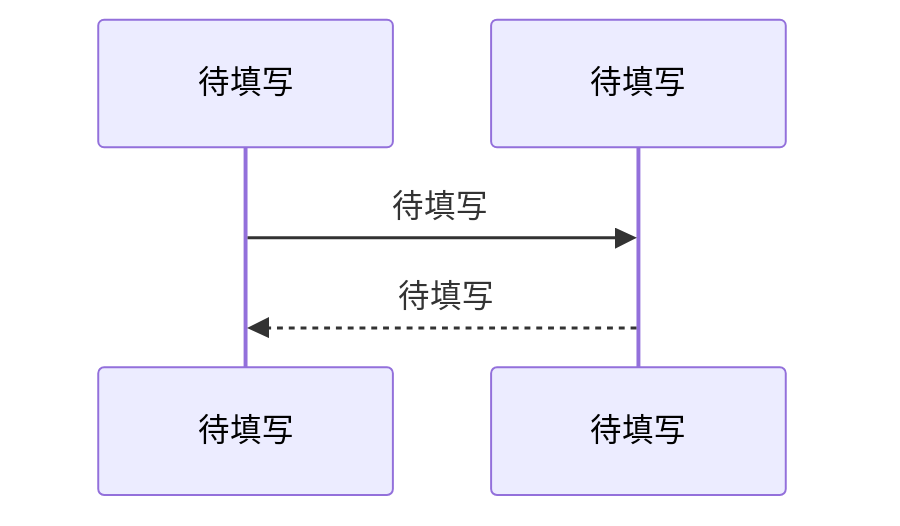

<!-- GEN: 章节规则 -->
<!--
  章节数量由模块的**综合权重**决定：

  **综合权重高** → 全部 8 章节完整展开（概述 + 核心数据模型 + 对外接口契约 + 核心业务流程 + 状态机 + 异常处理与容错策略 + 并发安全与一致性保证 + 性能特征与资源消耗）

  **综合权重中等** → 8 章节都出现，但无内容的章节一句话说明，不展开（如"本模块无状态流转，不涉及状态机"）

  **综合权重低** → 只需 3 章节：概述 + 核心数据模型 + 对外接口契约；其余章节省略（不出现）

  综合权重由 6 个维度评估：
    1. 功能重要度 — 模块在系统中的业务关键程度
    2. 结构复杂度 — 类/组件数量、继承深度、设计模式数量
    3. 接口广度 — 对外公开的方法/API 数量
    4. 数据 richness — 核心实体数量、字段数量、关系复杂度
    5. 变更热度 — 近期修改频率、历史 bug 密度
    6. 风险集中度 — 已知问题数量、耦合模块数量

  **God Class 特殊规则**：MainWindow 等承担 ≥4 种职责的类必须单独成文。
  文档内部按职责拆分子节（3-5 个），每个子节有自己的流程描述。

  **章节编写顺序（强制）**：不要按模板的线性顺序写。按分析难度倒序进行：
  1. 先写异常处理 + 并发安全（最需要深度分析，消耗最大注意力）
  2. 再写核心业务流程 + 状态机
  3. 再写对外接口契约 + 核心数据模型（最容易从代码提取）
  4. 最后写概述（此时已对整个模块有深入理解，概述质量最高）

  **多组件模块组织规则（强制）**：如果本文档覆盖 N ≥ 2 个独立类/组件：
  - 核心数据模型 → 每个组件必须提供独立的字段表 + 约束
  - 对外接口契约 → 每个组件必须提供独立的公开方法表
  - 异常处理与容错 → 每个组件必须提供独立的异常场景表
  禁止在概述中列出某个组件但在后续章节中不再出现。

  各章节"不涉及"时的标准措辞：
    核心业务流程 → "本模块无多步骤业务流程。"
    状态机 → "本模块不管理有生命周期状态流转的实体。"
    异常处理与容错 → "本模块无异常处理逻辑。"
    并发安全 → "本模块无共享状态，无并发风险。" 或 "本模块无内置并发保护。"
    性能特征 → "本模块无性能敏感路径。"
-->

# 待填写 详细设计

## 概述

<!-- GEN: 概述引导 -->
<!--
  必须包含：
  1. 核心职责的一句话精确定义
  2. 在系统中的定位（引用 00-架构.md 依赖图中的位置）
  3. 负向限制：如实列出模块明确不做什么。模块确实没有明确边界时写"未识别明确的负向限制"。
     本模块绝对不做什么。列出代码中实际可识别的条目。
  4. 设计意图推断（逆向工程，标记 推断）-->

**核心职责**：待填写

**系统定位**：待填写

**负向限制**：
- 待填写

**设计意图推断**（逆向工程，标记 推断）：待填写

## 核心数据模型

<!-- GEN: 数据模型引导 -->
<!--
  列出本模块拥有的核心实体和关键字段。
  每个字段：名称、类型、约束、默认值、含义、代码证据。
  只列核心字段——完整字段列表以代码为准，文档做提炼和语义说明。
  必须包含实体间关系的文字说明和关键数据约束。

  `证据` 列使用符号锚点格式：`StructName::fieldName`，指向代码中的结构体/类成员定义。-->

### 待填写

| 字段 | 类型 | 约束 | 默认值 | 含义 | 证据 |
|------|------|------|--------|------|------|
| 待填写 | 待填写 | 待填写 | 待填写 | 待填写 | 待填写 |

**实体关系**：待填写

**关键约束**：
- 待填写

## 对外接口契约

<!-- GEN: 接口契约引导 -->
<!--
  记录本模块所有对外公开的 API 或函数。不列内部辅助函数。

  每个接口必须包含：
  - 签名/路径
  - 参数（类型/必填/默认值）
  - 返回值/响应格式
  - 副作用：会读写哪些全局状态（数据库/缓存/文件系统）
  - 幂等性：有则说明机制；没有则注明为潜在风险

  代码证据使用符号锚点格式：`ClassName::methodName` 或 `ClassName::methodName(参数类型)`。-->

### 待填写

- **签名**：待填写
- **参数**：

| 参数 | 类型 | 必填 | 默认值 | 说明 |
|------|------|------|--------|------|
| 待填写 | 待填写 | 是/否 | 待填写 | 待填写 |

- **返回值**：待填写
- **副作用**：待填写
- **幂等性**：待填写

## 核心业务流程

<!-- GEN: 业务流程引导 -->
<!--
  如有 → 使用 Mermaid sequenceDiagram 或 flowchart，节点使用实际函数名/模块名。
  图后用简短摘要（2-3 行）说明要点，不逐行重复图中信息。
  如无 → 标准措辞。-->

**要点**：待填写（2-3 行概括图中关键步骤）

## 状态机

<!-- GEN: 状态机引导 -->
<!--
  如有 → 每行：当前状态 → 触发事件 → 目标状态 → 守卫条件 → 副作用。
  如无 → 标准措辞。-->

| 当前状态 | 触发事件 | 目标状态 | 守卫条件 | 副作用 |
|----------|----------|----------|----------|--------|
| 待填写 | 待填写 | 待填写 | 待填写 | 待填写 |

## 异常处理与容错策略

<!-- GEN: 异常处理引导 -->
<!--
  如有异常处理逻辑（try-catch/错误回调/降级/重试/超时/熔断）→ 写异常处理表。
  如无 → 标准措辞。
  如果存在共享资源但无并发保护 → 写入 04-问题与改进.md > 模块陷阱。-->

**异常处理策略**：

| 异常/错误场景 | 处理策略 | 代码位置 | 是否充分 |
|--------------|----------|----------|----------|
| 待填写 | 待填写 | 待填写 | 是/否 |

## 并发安全与一致性保证

<!-- GEN: 并发安全引导 -->
<!--
  如有共享状态保护机制（锁/Mutex/事务/原子操作/并发集合/乐观锁）→ 写风险点表。
  如无 → 标准措辞。
  如果存在共享资源但无并发保护 → 写入 04-问题与改进.md > 模块陷阱。-->

| 风险点 | 保护机制 | 作用范围 | 代码证据 | 潜在缺口 |
|--------|----------|----------|----------|----------|
| 待填写 | 待填写 | 待填写 | 待填写 | 待填写 |

## 性能特征与资源消耗

<!-- GEN: 性能特征引导 -->
<!--
  如有性能敏感路径（高复杂度算法、大数据量处理、频繁 I/O）→ 写复杂度 + 资源密集点。
  如无 → 标准措辞。-->

**核心路径复杂度**：待填写

**资源密集点**：待填写

---

<!--
  Agent 机械自检（以下项 Agent 可自信验证）：
  - [ ] front matter 字段非空且值在允许集合内
  - [ ] 无 "..." 或 "待填写" 残留
  - [ ] 无遗漏必需章节（高权重 8 章 / 中权重 8 章含 N/A / 低权重 3 章）
  - [ ] 不涉及的章节使用了标准措辞（无展开、无解释）
  - [ ] 章节数与模块综合权重匹配（已验证 6 维度评估结果与章节展开级别一致）
  - [ ] 接口契约每个端点含副作用和幂等性说明
  - [ ] 所有证据列使用符号锚点格式（StructName::fieldName / ClassName::methodName）
  - [ ] 章节编写顺序已按推荐顺序执行（异常/并发 → 流程/状态机 → 接口/数据 → 概述）
  - [ ] 多组件模块组织规则已遵守（如 N≥2 组件，数据模型/接口/异常处理均有独立子节）
  - [ ] God Class 规则已遵守（≥4 种职责的类单独成文，按职责拆分子节）

  深度自检（Agent 生成完成后逐项回答）：
  - [ ] **异常处理深度**：是否仅为标准 N/A 话术？如是，确认代码中确实无任何 try-catch/错误回调——检查每个 public 方法的 return 语句和错误路径
  - [ ] **并发安全深度**：是否仅为标准 N/A 话术？如是，确认模块确实无共享状态——检查所有成员变量是否仅被单线程访问、是否有跨线程信号槽连接

  语义质量项（数据流完整性、认知准确性、符号锚点正确性等）
  由阶段 SOP 的人类确认清单覆盖，不在此自检。
-->
