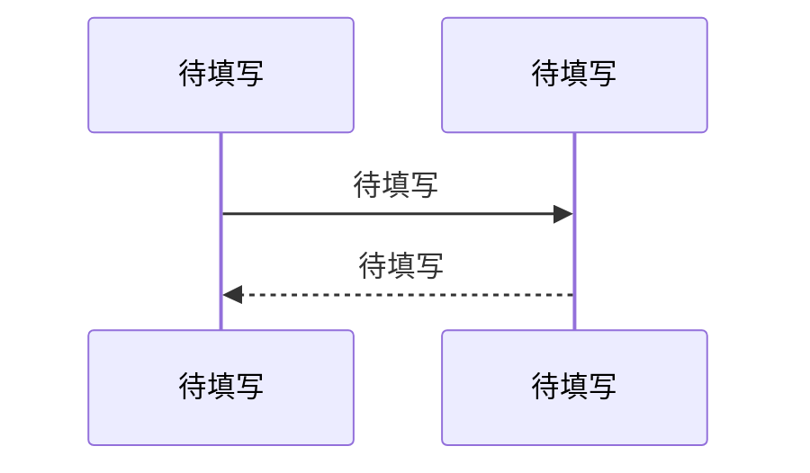

<!-- GEN: 模式说明 -->
<!--
  本模板服务两种模式：
  - 逆向工程（reverse-engineering）：通过对模块代码的逆向分析生成，描述模块的实际实现。
  - 正向设计（human-design）：定义模块的计划设计，作为编码的契约。-->

<!-- GEN: 章节规则 -->
<!--
  以下所有章节必须全部出现，一章不落。
  每章如实描述模块的实际情况：
    - 有相关内容 → 按本章的 GEN 引导详细编写
    - 没有相关内容 → 写标准措辞（一字不改），不展开、不解释
  禁止以"模块简单/代码量少"为由跳过任何章节。

  各章节"不涉及"时的标准措辞：
    核心业务流程 → "本模块无多步骤业务流程。"
    状态机 → "本模块不管理有生命周期状态流转的实体。"
    异常处理与容错 → "本模块无异常处理逻辑。"
    并发安全 → "本模块无共享状态，无并发风险。" 或 "本模块无内置并发保护。"
    性能特征 → "本模块无性能敏感路径。"
-->

# 待填写 详细设计

## 概述

<!-- GEN: 概述引导 -->
<!--
  必须包含：
  1. 核心职责的一句话精确定义
  2. 在系统中的定位（引用 00-架构.md 依赖图中的位置）
  3. 负向限制：如实列出模块明确不做什么。模块确实没有明确边界时写"未识别明确的负向限制"。
     本模块绝对不做什么。列出代码中实际可识别的条目。
  4. 设计意图推断（逆向工程，标记 推断）-->

**核心职责**：待填写

**系统定位**：待填写

**负向限制**：
- 待填写

**设计意图推断**（逆向工程，标记 推断）：待填写

## 核心数据模型

<!-- GEN: 数据模型引导 -->
<!--
  列出本模块拥有的核心实体和关键字段。
  每个字段：名称、类型、约束、默认值、含义、代码证据。
  只列核心字段——完整字段列表以代码为准，文档做提炼和语义说明。
  必须包含实体间关系的文字说明和关键数据约束。
  
  可信度标注：`置信度` 列仅标注 ⚠️（推断）或 ❓（推测），已确认留空。-->

### 待填写

| 字段 | 类型 | 约束 | 默认值 | 含义 | 置信度 | 证据 |
|------|------|------|--------|------|--------|------|
| 待填写 | 待填写 | 待填写 | 待填写 | 待填写 | 待填写 | 待填写 |

**实体关系**：待填写

**关键约束**：
- 待填写

## 对外接口契约

<!-- GEN: 接口契约引导 -->
<!--
  记录本模块所有对外公开的 API 或函数。不列内部辅助函数。
  
  每个接口必须包含：
  - 签名/路径
  - 参数（类型/必填/默认值）
  - 返回值/响应格式
  - 副作用：会读写哪些全局状态（数据库/缓存/文件系统）
  - 幂等性：有则说明机制；没有则注明为潜在风险

  逆向工程：每个参数和返回值的可信度仅标注 ⚠️ 或 ❓。-->

### 待填写

- **签名**：待填写
- **参数**：

| 参数 | 类型 | 必填 | 默认值 | 说明 |
|------|------|------|--------|------|
| 待填写 | 待填写 | 是/否 | 待填写 | 待填写 |

- **返回值**：待填写
- **副作用**：待填写
- **幂等性**：待填写

## 核心业务流程

<!-- GEN: 业务流程引导 -->
<!--
  如有 → 使用 Mermaid sequenceDiagram 或 flowchart，节点使用实际函数名/模块名。
  图后用简短摘要（2-3 行）说明要点，不逐行重复图中信息。
  如无 → 标准措辞。-->

**要点**：待填写（2-3 行概括图中关键步骤）

## 状态机

<!-- GEN: 状态机引导 -->
<!--
  如有 → 每行：当前状态 → 触发事件 → 目标状态 → 守卫条件 → 副作用。
  如无 → 标准措辞。-->

| 当前状态 | 触发事件 | 目标状态 | 守卫条件 | 副作用 |
|----------|----------|----------|----------|--------|
| 待填写 | 待填写 | 待填写 | 待填写 | 待填写 |

## 异常处理与容错策略

<!-- GEN: 异常处理引导 -->
<!--
  如有异常处理逻辑（try-catch/错误回调/降级/重试/超时/熔断）→ 写异常处理表。
  如无 → 标准措辞。
  如果存在共享资源但无并发保护 → 写入 04-问题与改进.md > 模块陷阱。-->

**异常处理策略**：

| 异常/错误场景 | 处理策略 | 代码位置 | 是否充分 |
|--------------|----------|----------|----------|
| 待填写 | 待填写 | 待填写 | 是/否 |

## 并发安全与一致性保证

<!-- GEN: 并发安全引导 -->
<!--
  如有共享状态保护机制（锁/Mutex/事务/原子操作/并发集合/乐观锁）→ 写风险点表。
  如无 → 标准措辞。
  如果存在共享资源但无并发保护 → 写入 04-问题与改进.md > 模块陷阱。-->

| 风险点 | 保护机制 | 作用范围 | 代码证据 | 潜在缺口 |
|--------|----------|----------|----------|----------|
| 待填写 | 待填写 | 待填写 | 待填写 | 待填写 |

## 性能特征与资源消耗

<!-- GEN: 性能特征引导 -->
<!--
  如有性能敏感路径（高复杂度算法、大数据量处理、频繁 I/O）→ 写复杂度 + 资源密集点。
  如无 → 标准措辞。-->

**核心路径复杂度**：待填写

**资源密集点**：待填写

---

<!--
  Agent 机械自检（以下项 Agent 可自信验证）：
  - [ ] front matter 字段非空且值在允许集合内
  - [ ] 无 "..." 或 "待填写" 残留
  - [ ] 所有章节全部出现（无遗漏）
  - [ ] 不涉及的章节使用了标准措辞（无展开、无解释）
  - [ ] 接口契约每个端点含副作用和幂等性说明
  - [ ] 置信度仅标注 ⚠️/❓（逆向工程），已确认留空
  - [ ] 已知问题/陷阱 → 已写入 04-问题与改进.md 而非本文档

  语义质量项（数据流完整性、认知准确性、可信度标注正确性等）
  由阶段 SOP 的人类确认清单覆盖，不在此自检。
-->
