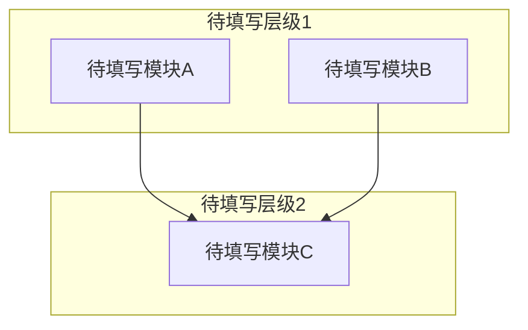

# 系统架构

<!-- 概述引导 -->
<!--
  写 2-4 句概述段落，描述系统的整体架构。
  每个结论都附带代码证据，使用符号锚点格式：
    ClassName::methodName()  或  filename.cpp → functionName()
-->

## 模块划分

<!-- 模块划分引导 -->
<!--
  为每个模块写出 2-3 句职责描述。不要仅写模块名。

  内聚性规则：模块划分必须通过"与"测试 — 合并后的模块名不得使用
  "与/和/及"来连接不相关的概念。如果一个模块需要"X与Y"来命名，
  说明它应当拆分为两个独立模块。

  综合权重评估：对每个模块从以下 6 个维度给出 1-5 分的综合权重：
    1. 功能重要度 — 该模块对核心业务的价值
    2. 结构复杂度 — 代码规模、类层次深度
    3. 接口广度 — 公开 API 数量、被依赖的模块数
    4. 数据 richness — 处理的数据结构复杂度、状态数量
    5. 变更热度 — 近期修改频率、需求变动可能性
    6. 风险集中度 — 出问题时的影响范围和修复难度
  综合权重 = 六维评分之和，用于指导 review 和重构的优先级。

  "核心职责" 列说明该模块解决什么问题、对外提供什么能力。
  "复杂度概要" 列标注：代码规模（大概行数/文件数）+ 公开接口数量 + 依赖数量。
  格式示例："~500 行/8 文件，6 个公开 API，依赖 3 个模块"
-->

| 模块名 | 所属层级 | 核心职责 | 目录路径 | 依赖模块 | 复杂度概要 | 综合权重 |
|--------|----------|----------|----------|----------|------------|----------|
| 待填写 | 待填写 | 待填写 | 待填写 | 待填写 | 待填写 | 待填写 |

## 模块依赖关系图

<!-- 依赖关系图引导 -->
<!--
  必须包含模块划分表中的每一个模块。用 mermaid subgraph 按层级分组
  （表示层 / 业务逻辑层 / 数据访问层 / 基础设施层）。
  箭头方向表示依赖关系：A --> B 表示 A 依赖 B。
  如果存在循环依赖，如实画出——循环依赖条目写入 04-问题与改进.md > 架构违规。
  不允许使用省略号——每个模块都必须显式出现在图中。
-->

## 数据流

<!-- 数据流引导 -->
<!--
  描述项目的核心端到端数据流。数量由项目复杂度自然决定。
  每条覆盖完整链路：触发条件 → 入口模块 → 经过的模块链 → 数据形态变化 → 持久化点 → 出口/终点。
  至少覆盖 1 条读路径和 1 条写路径。仅能识别出 1 条时，说明原因。

  每个数据流步骤必须使用符号锚点格式：
    ClassName::methodName()  或  filename.cpp → functionName()

  每条数据流用 ### 标题 + 有序列表组织，不使用表格。
-->

### 数据流 1: 待填写

**触发**：待填写（什么事件/请求启动了这条流）

**链路**：
1. **模块A** `ModuleA::entryPoint()` — 做什么
2. **模块B** `ModuleB::processData()` — 做什么
3. **模块C** `ModuleC::persist()` — 做什么

**数据形态变化**：待填写 → 待填写 → 待填写

**持久化点**：待填写（数据库表/文件/缓存 key）

### 数据流 2: 待填写

**触发**：待填写

**链路**：
1. **模块A** `ModuleA::query()` — 做什么
2. **模块B** `ModuleB::format()` — 做什么

**数据形态变化**：待填写 → 待填写

**持久化点**：待填写

## 外部依赖

<!-- 外部依赖引导 -->
<!--
  列出项目运行时依赖的所有外部系统和中间件，不包括开发工具（构建/测试工具见 02-决策记录.md）。
  按关键程度排序，关键的放前面。
  "故障影响"列：描述该依赖不可用时系统会出现什么症状。
-->

| 依赖 | 用途 | 关键程度 | 故障影响 |
|------|------|----------|----------|
| 待填写 | 待填写 | 高/中/低 | 待填写 |

## 认知边界地图

<!-- 认知边界引导 -->
<!--
  建立知识资产负债表，区分三个层次：
  - 已知已知：通过阅读具体代码确认的事实
  - 已知未知：Agent 无法确定、需要人工补充的内容
  - 推断结论：从代码模式推断但未确认的设计决策

  已知已知验证标准：证据列必须使用符号锚点格式
    ClassName::methodName()  或  filename.cpp → functionName()
  已知未知应写具体问题（如"身份验证机制：未找到 token 生成/验证的代码位置"）。
  推断结论的可靠性：有符号锚点 = 代码证据充分；无锚点 = 基于有限证据，待确认。
-->

### 已知已知

| 编号 | 代码证据（符号锚点） | 确认内容 |
|------|----------------------|----------|
| 待分析 | 待分析 | 待分析 |

### 已知未知

| 编号 | 未知内容 | 影响 | 调查方向 |
|------|----------|------|----------|
| 待分析 | 待分析 | 待分析 | 待分析 |

### 推断结论

| 编号 | 推断内容 | 证据 |
|------|----------|------|
| 待分析 | 待分析 | 待分析 |

---

<!--
  Agent 机械自检（以下项 Agent 可自信验证）：
  - [ ] front matter 字段非空且值在允许集合内
  - [ ] 每个表格至少有一行非占位数据
  - [ ] 模块依赖关系图包含模块划分表中的所有模块
  - [ ] 外部依赖表涵盖所有运行时依赖（版本/协议细节 → 02）
  - [ ] 认知边界地图三个子表已填写
  - [ ] 无 "..." 占位符
  - [ ] 模块划分通过"与"测试：无模块名包含"与/和/及"
  - [ ] 数据流链路中每个步骤都使用了符号锚点格式
  - [ ] 认知边界地图证据列使用符号锚点格式

  深度自检（定性追问，Agent 生成完成后逐项回答）：
  - [ ] **数据流覆盖**：列出系统所有主要用户操作，是否每个主要操作都有独立的数据流追踪？如有操作缺少追踪，在文档中说明原因
  - [ ] **模块粒度**：是否存在一个"模块"包含了分属不同架构层级的类（如 View 和 Model 混在同一个模块中）？如有，是否有明确的合并理由？
  - [ ] **认知边界四维度**："已知未知"子表中是否至少包含以下维度的未知项：架构决策理由 / 未实现功能的预期行为 / 外部依赖的内部实现 / 性能约束的来源？如某维度为空，确认是否真的全部已知
  - [ ] **符号锚点验证**：所有数据流步骤和认知边界证据是否可定位到具体代码？锚点格式是否正确（ClassName::methodName 或 filename → functionName）？

  语义质量项（数据流完整性、认知准确性等）
  由阶段 2 SOP 的人类确认清单覆盖，不在此自检。
-->
