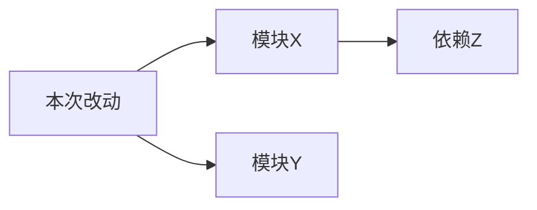

# proposal.md 模板

```markdown
---
title: "提案：[功能名称]"
type: proposal
created: YYYY-MM-DD
status: draft
---

# [功能名称]

## 背景与动机
[为什么要做这个改动]

[如有] 用户补充的实现思路、技术约束或关键上下文，由用户提供、经 AI 整理后保留于此。内容的准确性和可行性由 /sdd-explore 验证，本阶段仅记录不做评估。

## 目标
[要达成什么效果]

## 范围
### 包含
- [明确包含的内容]

### 不包含
- [明确排除的内容]

## 影响范围分析



## 验收标准
- [ ] [可验证的验收条件1]
- [ ] [可验证的验收条件2]
```
